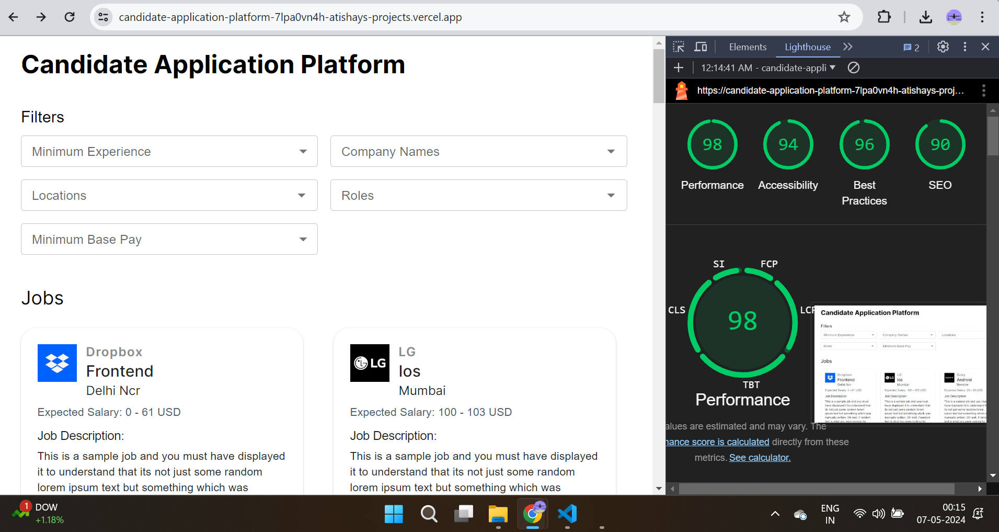

# Candidate Application Platform [[Live Link]](https://candidate-application-platform-7lpa0vn4h-atishays-projects.vercel.app)
A candidate application platform that enables users to browse and filter jobs based on criteria such as role, location, pay and more. With the implementation of infinite scroll, users can seamlessly explore job opportunities in a user-friendly interface.

### Features:
- Job listings displayed as cards with details including job title, company name, location, job description, experience required, and apply button.
- Filters to refine jobs based on criteria such as minimum experience, company name, location, role, and minimum base pay.
- Infinite scroll to load additional jobs automatically as the user scrolls down the page.
- Responsive design for compatibility with different screen sizes, including mobile devices.

### Production Link:
Deployed on Vercel: [https://custom-video-player-with-playlist.vercel.app](https://candidate-application-platform-7lpa0vn4h-atishays-projects.vercel.app)

### Performance (Lighthouse Report):

### Technologies Used:
- Next.js
- React.js
- Redux
- MUI
- HTML5
- CSS
- JavaScript
- Intersection Observer API for implementing the infinite scroll feature.

### How to Run Locally:

1. Clone the repository to your local machine: git clone [https://github.com/At1902/Custom-Video-Player-with-Playlist.git](https://github.com/At1902/Candidate-Application-Platform.git)
2. Navigate to the project directory
3. Install dependencies: Run '**npm install**'
4. Start the development server: Run '**npm run dev**'
5. Open your browser and navigate to http://localhost:3000 to view the application.
6. Format the files: Run '**npm run format**' to prettify all files and ensure consistent code formatting across the project in one go.

### API Integration:
The platform integrates with a sample API to fetch job listings. The API endpoint provides job data including job role, company name, location, job description, experience required, pay and more.

### Notes:
- Implement custom(in-house) infinite scroll for a smoother browsing experience using Intersection Observer API.
- Add "global-error.js" and "not-found.js" to handle errors and unreachable routes.
- Responsive design for compatibility with different screen sizes, including mobile devices.
- Use modular CSS styling, ensuring better organization and encapsulation of styles for individual components.

### Optimizations:
- Use Next.js for improved performance and SEO benefits.
- Implement lazy loading for efficient resource utilization and faster load times.
- Can enhance filter functionality for a more refined job search experience by handling it on server-side.
